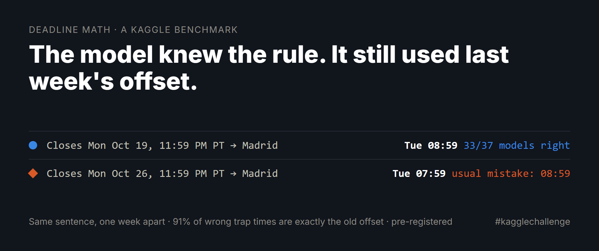
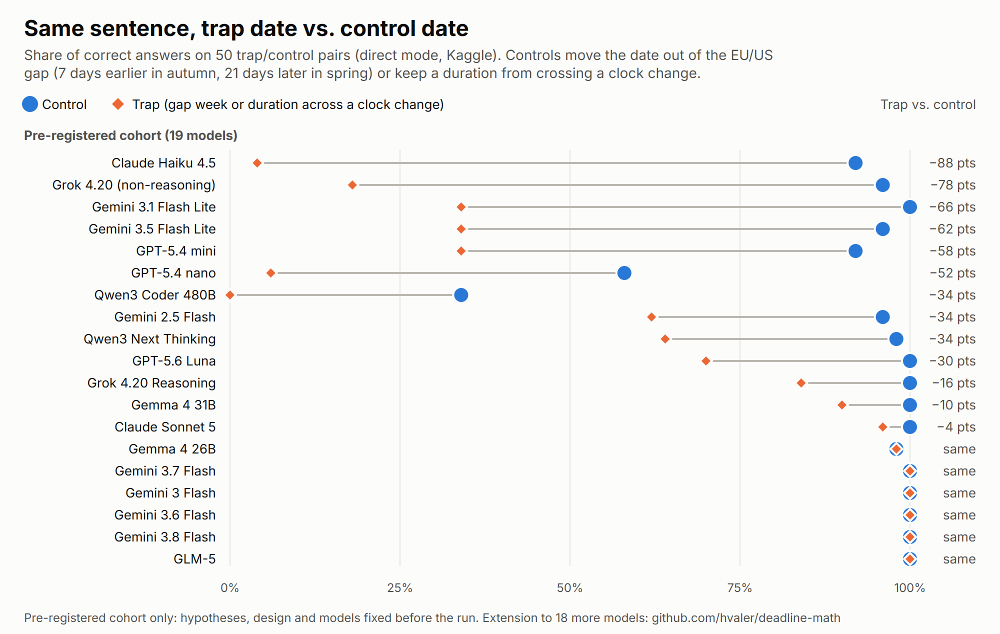

# Deadline Math

[](https://github.com/hvaler/deadline-math/actions/workflows/tests.yml)
[](https://www.kaggle.com/benchmarks/hugovalerrojas/deadline-mat)
[](https://dev.to/hugo_valer_79d0d94e00804b/the-model-knew-the-rule-it-still-used-last-weeks-offset-584m)
[](docs/preregistro-original-es.md)
[](LICENSE)

**¿Sabe un modelo de lenguaje pasar un plazo publicado a la hora local de quien lo lee?**
«Submissions close October 28, 2026 at 11:59 PM PT»: ¿qué hora es eso en Madrid?

Un benchmark creado en [Kaggle Community Benchmarks](https://www.kaggle.com/benchmarks) para el
[DEV × Kaggle Benchmarking Challenge](https://dev.to/challenges/kaggle-2026-09-23). *Read in English:
[README.md](README.md).*



## Hallazgos principales

En 2026, Europa vuelve al horario de invierno el 25 de octubre y Estados Unidos el 1 de noviembre; en primavera,
Estados Unidos cambia primero (8 de marzo) y Europa después (29 de marzo). Durante esas semanas, la diferencia
horaria habitual entre ambos lados falla por una hora.

- **El fallo es mecánico, no aleatorio.** En una prueba prerregistrada con 50 pares trampa/control (la misma frase
  con la fecha dentro o fuera de esas semanas), **el 91 % de las respuestas erróneas con hora (293 de 321) son
  exactamente la respuesta ingenua**: la diferencia de siempre, o sumar horas de reloj por encima de un cambio de hora.
- **La trampa cuesta 29,8 puntos de acierto** de media a los 19 modelos prerregistrados (IC 95 %: +25,4 a +34,2);
  13 empeoran y ninguno mejora. **El resultado se repitió** en una segunda ejecución (+29,6 puntos, 91 %).
- **Es cuestión de generación, no de tamaño.** Claude Sonnet 4.5 acierta el 100 % de los controles y el 6 % de las
  trampas; dentro de cada línea de Claude la costumbre desaparece versión a versión, y los modelos más recientes
  probados (Claude Opus 5.5 y Sonnet 5.5, GPT-6 Sol, GPT-6.1 Sol) ya no cometen el error.
- **La temperatura 0 no es determinista:** dos ejecuciones del mismo modelo coinciden en el 92 % de los casos.

**Lección práctica:** que el modelo extraiga la fecha, la hora y la zona, y que la cuenta la haga una biblioteca de
husos horarios.



Resultados completos, con intervalos de Wilson y pruebas de McNemar exactas, separando la cohorte prerregistrada de
los análisis secundarios: **[benchmark/resultados/RESULTS.md](benchmark/resultados/RESULTS.md)** (en inglés).

## Diseño

| Conjunto | Casos | Modos | Estado |
|---|---|---|---|
| Pares | 100 (50 pares trampa/control) | directo | **prerregistrado** ([original](docs/preregistro-original-es.md), [traducción](docs/PREREGISTRATION.md)) |
| Estándar | 20 | directo, razonado | diseñado primero |
| Difícil | 11 | directo, razonado | exploratorio |

- **Respuesta correcta exacta, sin juez LLM.** Cada respuesta se calcula con `zoneinfo` de Python y debe coincidir
  con una respuesta escrita a mano al importar el módulo; los 100 casos de pares se comprueban además con una
  implementación independiente, escrita a mano, de las reglas de cambio de hora de 2026 en EE. UU. y la UE (ver las
  pruebas).
- **Puntuación:** un caso es correcto si la última línea `ANSWER: YYYY-MM-DD HH:MM` de la respuesta coincide con la
  respuesta correcta. El cumplimiento estricto del formato de una sola línea se informa aparte.
- **Modelos:** todos los que ofrecía Kaggle Community Benchmarks (46 hasta el 6 de octubre de 2026); 43 completaron
  las cuatro tasks originales. Los fallos de infraestructura (HTTP 403/404/429/503) cuentan como *no completados*,
  nunca como 0 %.
- **Protocolo:** las versiones aceptadas de cada task están fijadas en `benchmark/kaggle_resultados.py`; se comprueba
  que cada ejecución descargada usó exactamente los prompts del código actual.

## Estructura del repositorio

```
benchmark/
  deadline_math.py        casos, prompts, oráculo y task de Kaggle (fuente única)
  construir_kaggle.py     genera los seis ficheros autocontenidos de benchmark/kaggle/
  kaggle_resultados.py    tablas por task a partir de las ejecuciones descargadas, con versiones fijadas
  analisis_pares.py       análisis prerregistrado: Wilson, McNemar exacta, bootstrap, prueba de signos
  tablas_en.py            genera RESULTS.md
  cifras_articulo.py      todas las cifras citadas en el artículo, calculadas desde los datos
  grafico_pares.py        el gráfico trampa/control
  piloto.py               ejecutor del piloto local a través del proxy de modelos de Kaggle
  tests/                  25 pruebas (oráculos, parser, clasificación, selección de versión y réplica)
  resultados/
    RESULTS.md            resultados finales (en inglés)
    kaggle/               ejecuciones brutas descargadas de Kaggle, con las trayectorias completas
    piloto-*.jsonl        ejecuciones del piloto local
docs/
  preregistro-original-es.md   prerregistro original (el que manda)
  PREREGISTRATION.md      traducción al inglés, con desviaciones y registro de ejecución
  img/                    figuras
```

Los docstrings y comentarios del código fuera de `deadline_math.py` están en español.

## Reproducir

Python 3.12.

```bash
python -m venv .venv
source .venv/bin/activate            # Windows: .venv\Scripts\activate
pip install -r requirements.txt
python -m unittest discover -s benchmark/tests -v   # oráculos, parser y análisis
python benchmark/tablas_en.py                       # regenera RESULTS.md desde benchmark/resultados/kaggle/
python benchmark/cifras_articulo.py                 # todas las cifras del artículo
```

Para ejecutar las tasks por tu cuenta necesitas una cuenta de Kaggle con verificación de teléfono e identidad,
`kaggle benchmarks init`, y después `kaggle b t push <task> -f benchmark/kaggle/<task>.py` y
`kaggle b t run <task> -m <modelo>`.

## Cómo citarlo

```bibtex
@misc{valer2026deadlinemath,
  title        = {Deadline Math: LLMs and time-zone conversion of published deadlines},
  author       = {Valer Rojas, Hugo Carlos},
  year         = {2026},
  howpublished = {Kaggle Community Benchmarks},
  url          = {https://www.kaggle.com/benchmarks/hugovalerrojas/deadline-mat}
}
```

El botón «Cite this repository» de GitHub usa [CITATION.cff](CITATION.cff).

## Licencia y transparencia

Código con [licencia MIT](LICENSE). Las respuestas de los modelos en `benchmark/resultados/` se publican como
evidencia del análisis. Se usó IA (Claude) como ayuda para el código, el análisis y la redacción; el autor eligió el
problema, tomó las decisiones de diseño y revisó cada afirmación.
